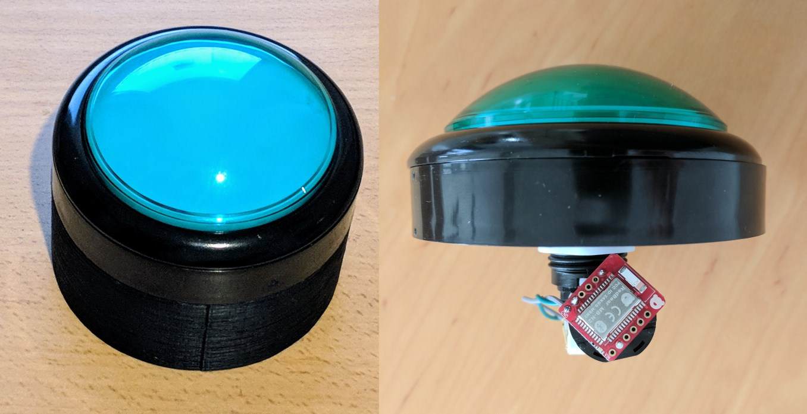

# Bluetooth Buzzer Button

A Bluetooth Low Enegry Buzzer Button, with remotely controlable light.

The button is JavaScript programmable, using the [Espruino](https://espruino.com) embedded JavaScript runtime. You can find an example firmware [here](firmware/main.js).

The button runs off a single CR2032 battery, and can run for several months in standby mode. It was originally created as part of my [In-Real-Life Chrome T-Rex Game](https://medium.com/@urish/i-saw-a-dinosaur-or-how-i-built-a-real-life-version-of-chrome-t-rex-game-92175f6cad2c) project.

See this [example plunkr](https://plnkr.co/edit/uwBsIR2xN8AFZZyoSz7F) for interfacing with the button using Web Bluetooth.

## Parts

| Part Name | Price | Comments |
|-----------|-------|---------|
| [Big Dome Pushbutton - Green](https://www.sparkfun.com/products/11275) | $9.95 | Red / Blue / Yellow colors are also available |
| [RedBearLab BLE Nano v2](https://www.sparkfun.com/products/14070) | $16.95 | You will also need a programmer, such as [this one](https://www.sparkfun.com/products/14154) |
| [Coin Cell Battery Holder - 20mm (PTH)](https://www.sparkfun.com/products/783) | $1.50 |  |
| [Super Bright LED - Green 10mm](https://www.sparkfun.com/products/8861) | $1.50 | Optional, for extra brightness |

You will also need a standard, CR2032 coin battery. You can order them from [SparkFun](https://www.sparkfun.com/products/338) as well, or simply get one from a local hardware store.
